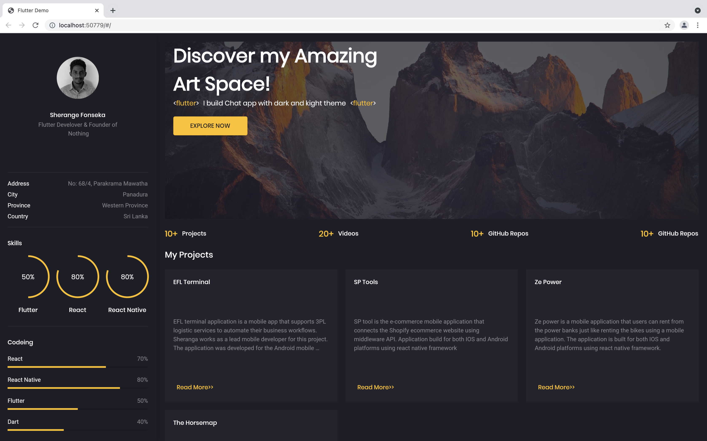
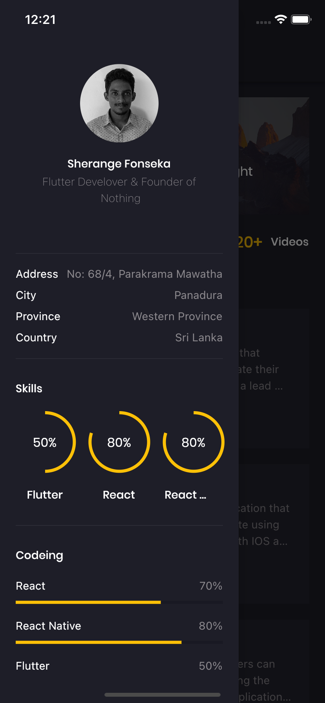

# Portfolio App




Flutter Responsive Portfolio App
* For Web: 

## Getting Started
This is a flutter single page web application and its have mobile responsive UI. The app code is preloaded with some basic widgets like basic app architecture, app theme, constants and required dependencies


## How to Use 

**Step 1:**

Download or clone this repo by using the link below:

```
https://github.com/Sherange/portfolio-app.git
```

**Step 2:**

Go to project root and execute the following command in console to get the required dependencies: 

```
flutter pub get 
```

**Step 3:**

Execute the following command to run project in android:

```
flutter run android
```

## App Features:


* Home Page
* Sidebar
* Theme

### Libraries & Tools Used

* [Google Fonts](https://pub.dev/packages/google_fonts)
* [Flutter SVG](https://pub.dev/packages/flutter_svg)
* [Animated Text Kit](https://pub.dev/packages/animated_text_kit)

### Folder Structure
Here is the core folder structure which flutter provides.

```
flutter-app/
|- android
|- assets
|- build
|- ios
|- lib
|- test
```

Here is the folder structure we have been using in this project

```
lib/
|- models/
|- screens/
|- main.dart
|- responsive.dart
|- constants.dart
```

Now, lets dive into the lib folder which has the main code for the application.

```
1 models 
  - Contains the data models of application example Project list and Recommendations data. 
2 screens 
  — Contains the common widgets for your applications. For example, Home, Profile etc.
3 main.dart 
  - This is the starting point of the application. All the application level configurations are defined in this file i.e, theme, title
4 responsive.dart 
  - Handle the responsivnes of the app using app context.
5 constants.dart 
  - All the application level constants are defined in this file. contains the constants for `theme`, `dimentions`, `preferences` and `strings`
```


### SCREENS

This directory contains all the ui of your application. Each screen is located in a separate folder making it easy to combine group of files related to that particular screen. All the screen specific widgets will be placed in `components` directory as shown in the example below:

```
screens/
|- home
   |- home_screen.dart
   |- components
      |- home_banner.dart
      |- project_card.dart
```

### Main

This is the starting point of the application. All the application level configurations are defined in this file i.e, theme, routes, title, orientation etc.

```dart
import 'package:flutter/material.dart';
import 'package:google_fonts/google_fonts.dart';
import 'package:portfolio_app/screens/home/home_screen.dart';
import 'constants.dart';

void main() {
  runApp(MyApp());
}


class MyApp extends StatelessWidget {
  // This widget is the root of your application.
  @override
  Widget build(BuildContext context) {
    return MaterialApp(
      debugShowCheckedModeBanner: false,
      title: 'Flutter Demo',
      theme: ThemeData.dark().copyWith(
        primaryColor: primaryColor,
        scaffoldBackgroundColor: bgColor,
        canvasColor: bgColor,
        textTheme: GoogleFonts.poppinsTextTheme(Theme.of(context).textTheme)
            .apply(bodyColor: Colors.white)
            .copyWith(
                bodyText1: TextStyle(color: bodyTextColor),
                bodyText2: TextStyle(color: bodyTextColor)),
      ),
      home: HomeScreen(),
    );
  }
}
```